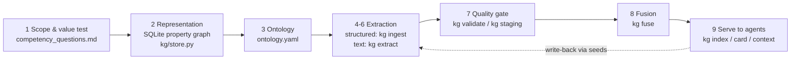
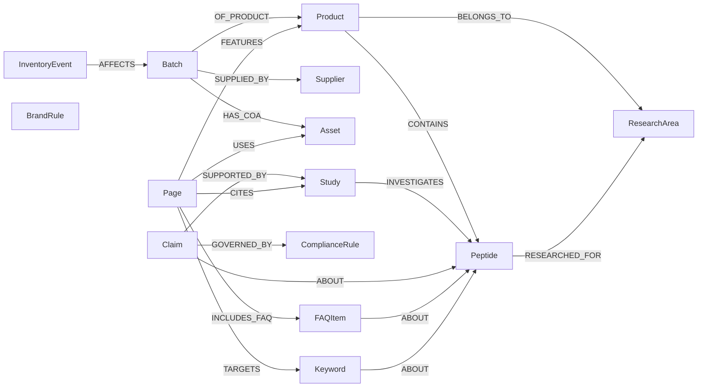
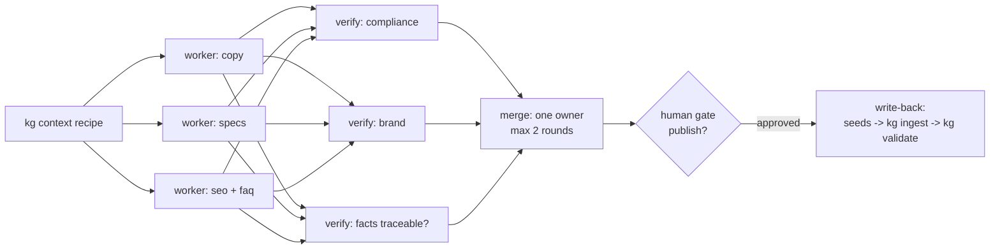

# Energy Peptides knowledge graph

AI infrastructure for a research-peptide company: one typed, provenance-tracked graph that agents read
through **progressive disclosure**, and four **task graphs** (product pages, FAQ/SEO, marketing copy,
inventory) that agents execute with separate verifiers and a human gate. Built with the
graph-engineering discipline: schema first, provenance on every fact, fuse before trusting, evaluate
at every stage.

## Quick start
```bash
uv sync
uv run kg rebuild            # seeds/ -> data/graph.db, prints the index
uv run kg validate           # must print OK
uv run kg context product_page "Product:BPC-157 10mg"
uv run kg gaps
uv run pytest -q             # competency questions as tests
```
Then in Claude Code, inside this directory: `/new-product-page BPC-157 / TB-500 20mg`.

## What the graph is for
| Need | How the graph serves it |
|---|---|
| Inventory & product management | Product → Batch → InventoryEvent ledger; `kg stock`, expiries and low stock in `kg gaps` |
| Building / extending the website | Page nodes + FEATURES/TARGETS/INCLUDES_FAQ edges; `product_page` and `faq_seo` recipes give an agent exactly the facts a page needs |
| On-brand, compliant copy | BrandRule and ComplianceRule nodes scoped by channel; Claim library (approved / prohibited); verifiers check drafts against them |
| Better AI output, less context | Recipes hand an agent ~100-250 lines instead of the whole corpus; every line carries source + confidence |

## The 9-stage pipeline as built here


## Ontology (14 types, 18 relations)

BrandRule and ComplianceRule attach to tasks by `scope` (product_page, faq, email, …), not by edges.

## Task graph (all four share this diamond)

Inventory is the exception: sequential, one agent, gate only on write-downs (the stop rule).

## Website
A custom storefront in `web/` (Astro 7, Cloudflare Pages/Workers, D1 for orders) renders straight from the graph.
Checkout runs against a stub adapter until the Kashu (TagadaPay) account is active; see `web/README.md` and
`docs/tagada-integration.md`.

## Layout
```
ontology.yaml            stage 3 — the schema and the context recipes (single source of truth)
competency_questions.md  stage 1/3 — what the graph must answer; mirrored in tests/
seeds/*.yaml             stages 4-6 for structured knowledge — THE editable knowledge base
kg/                      store, schema, ingest, serve, fuse, extract, gate, cli
taskgraphs/*.yaml        the drawn plans; .claude/skills/* execute them in Claude Code
site/pages/              approved page copy (rendered by the site); *.draft.md until approved
web/                     the storefront (see web/README.md); web/src/data/catalog.json is generated
site.yaml                brand, seller, shipping and RUO wording used by the site export
data/graph.db            derived; rebuilt from seeds; gitignored
```

## Adding knowledge
- **Structured** (a product, a batch, a rule): edit the seed file, `uv run kg ingest`, `uv run kg validate`.
  Ingest is strict: an edge whose endpoint is missing or whose domain/range is wrong rolls back the run.
- **Unstructured** (a supplier datasheet, a paper, a policy memo): `uv run kg extract path.md` stages
  entities and relations with evidence quotes (needs `ANTHROPIC_API_KEY` or `ant auth login`). Then
  `uv run kg staging list`, accept/reject ids, `uv run kg staging stats` — bulk accept is refused below 90%
  precision on ≥20 scored rows. Fix the prompt in `kg/extract.py`, not the output.
- **Duplicates**: `uv run kg fuse` (dry run) → `--apply` merges only ≥0.90 matches; the 0.60–0.90 band goes
  to `kg fuse review` for you. Merges keep conflicting values per source and record `merged_from`.
- **Facts that change** (a price, a purity): set `valid_from` on the seed item; `kg gaps` then flags live
  pages older than the change.

## What is deliberately unverified
Seed chemistry (MW, CAS), citations (PMIDs), compliance rules and brand voice were drafted by the model on
2026-09-08. They are `confidence: medium` and studies are `verified: false`. The task graphs refuse to
cite unverified studies, so verifying `seeds/07_studies.yaml` and `seeds/01_peptides.yaml` is the first
real job. Compliance rules are not legal advice.

## Credits
Method from the graph-engineering skill (distilled from Southeast University's Knowledge Graph course,
Prof. Peng Wang, https://github.com/npubird/KnowledgeGraphCourse).
